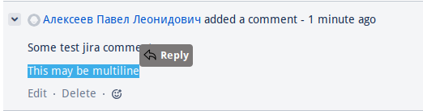

# JIRA reply .user.js script

[Installation link](https://github.com/Hubbitus/jira-reply.user.js/raw/main/jira-reply.user.js) for the impatient (please read section [installation](#installation) for the prerequisites and detailed instructions).

## Idea and purpose

[User.js](http://kb.mozillazine.org/User.js_file) script to enrich [Atlassian JIRA](https://www.atlassian.com/software/jira) functionality with fast and easy comment reply functionality.

### What it does and how to use

Jira does not provide possibility to organize comments in threads or reply. Event many years awaited issue [https://jira.atlassian.com/browse/JRACLOUD-3406](https://jira.atlassian.com/browse/JRACLOUD-3406) was closed for cloud and for server [JRASERVER-3406](https://jira.atlassian.com/browse/JRASERVER-3406) opened for years since 16/Mar/2004...

For threaded comments you may look at some alternatives and plugins in the market (may be non-free meantime).

But at least, when you replying you may want provide context, in which comment reply, what exactly replied and whom...

Ths leads a lot of manual code typing by template like:

    ```
    [~mention], you wrote at 2025-03-21 19:29:
    {quote}
        Citing sentence
    {quote}
    ```

And just after that only write your comment...
The idea of suc script is to automate such boilerplate! With it you may just select text and click "reply" button in the popup!

Screenshot: 

That is pretty simple!

## Installation

### Prerequisites: requires browser extension like `tampermonkey`

- [Chrome, chromium](https://chrome.google.com/webstore/detail/tampermonkey/dhdgffkkebhmkfjojejmpbldmpobfkfo?hl=en)
- [Firefox](https://addons.mozilla.org/en-US/firefox/addon/tampermonkey/)

### Script installation

Just follow the [installation link](https://github.com/Hubbitus/jira-reply.user.js/raw/main/jira-reply.user.js).

> **TIP** Script configured for auto-updates, just allow that in extension settings!

## Ideas and bug-reports are welcome!

Please report issues in this repository and ping me directly for any bugreports or needed enhancements!

# Licensed under MIT License
